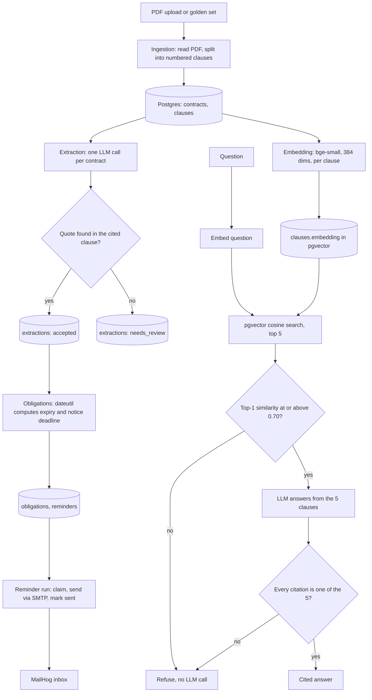

# ContractTracker: project flow, why RAG, and what each component is for

Audience: the project owner, for learning and for explaining the design.
Written from the code as it is on 2026-10-06. Where a document under `docs/genai/` disagrees, the ADRs and the code win (the GenAI solution doc says so itself).

## 1. What the project does

ContractTracker reads contract PDFs and gives the owner three things:

1. **Fields**: five facts per contract (parties, effective date, term, auto-renewal, notice period), each with the exact quote and clause it came from.
2. **Deadlines and reminders**: the expiry date and the notice deadline, computed by code, with emails 60, 30 and 7 days before.
3. **Cited answers**: free-text questions such as "Which law governs Supply Agreement 08?", answered with `[contract, clause]` citations, or the fixed reply "Not found in these contracts".

## 2. End-to-end flow

Three separate pipelines share one database:

| Pipeline | Entry point | Uses the LLM | Uses RAG |
| --- | --- | --- | --- |
| Ingest and extract | `UiService.upload`, `extract` (`app/ui/service.py`) | yes, once per contract | **no** |
| Deadlines and reminders | `UiService.send_due_reminders` | no | no |
| Question answering | `UiService.ask` | yes, once per question that passes the floor | **yes** |

### Step by step

1. **Ingest** (`app/ingestion/service.py`). Hash the file (SHA-256) and skip it if already stored. Read the text PDF with pypdf, split it into numbered clauses with `split_pages` (`app/ingestion/splitter.py`), and store the contract and all its clauses in one savepoint, so a contract never exists with half its clauses.
2. **Extract** (`app/extraction/service.py`). Send the whole contract, clause by clause, to the model with prompt `extract_fields` v2 and a strict JSON schema. Each field comes back as `{value, quote, clause_id}`. Code accepts a field only if the quote, after normalisation, is a substring of the clause it cites. Otherwise the field is stored as `needs_review` with a reason (`quote_not_found`, `clause_not_found`, `value_missing`, `invalid_reply`).
3. **Compute dates** (`app/obligations/compute.py`). The model returns text such as "three (3) months". Code parses it and computes expiry (the day before the term's anniversary) and the notice deadline with python-dateutil. Text the parsers do not understand is reported as unparsed, never guessed (ADR-0007).
4. **Plan reminders** (`app/reminders/plan.py`, `sync.py`). Each deadline gets reminders at 60, 30 and 7 days before. `sync_obligations` recomputes from accepted or corrected fields every time, so a corrected field replaces the old date and a field sent back to review removes its date.
5. **Send reminders** (`app/reminders/service.py`). Per deadline, send only the closest due reminder and skip older ones, so someone away for a month gets one email, not three. Claim the reminder (`pending` to `sending`), send by SMTP to MailHog, then mark it `sent`. If sending fails the reminder goes back to `pending`. A crash between send and mark leaves it in `sending` and it is never re-sent: a lost email is accepted over a doubled one. One gap remains: if SMTP accepts the message but the connection then times out, the mailer reports a delivery error, the reminder reverts to `pending`, and the next run can send a duplicate.
6. **Embed** (`app/retrieval/service.py`). `embed_missing` finds clauses with no vector, builds the text `"<title> | <number> <heading> | <body>"`, embeds it with BAAI/bge-small-en-v1.5 on CPU, and stores the vector in `clauses.embedding` with the model name. A second run writes nothing.
7. **Ask** (`app/qa/service.py`). Embed the question (with the bge query instruction), take the 5 nearest clauses by cosine, then apply three guards (section 4).

## 3. Why RAG when we already have Postgres?

Short answer: **Postgres is where the data lives. RAG is how the right few clauses are found and handed to the model. They are not alternatives.** Here, RAG runs inside Postgres: the vectors are a `vector(384)` column in the same database (ADR-0003).

### What Postgres alone cannot do

The questions are free text. A SQL query needs to know the column and the value in advance:

| Question | What SQL would need | What goes wrong |
| --- | --- | --- |
| "Can I get out early?" | a keyword that appears in the clause | The clause says "terminate for convenience" or "early termination fee". `LIKE '%out early%'` finds nothing. |
| "Which law governs Supply Agreement 08?" | knowing the clause is called "Governing Law" in every template | Real contracts vary the heading and phrasing. |
| "What is the liability cap?" | a parsed `liability_cap` column | Only 5 fields are extracted (ADR-0015). Anything else was never turned into a column. |

Full-text search (`tsvector`) matches words, not meaning, and the project rejected it for now (ADR-0013). Embeddings match meaning, so a paraphrase finds the clause.

### Why not just send every contract to the model

The GenAI design doc compared both (`docs/genai/contracttracker-solution.md`, section 4): with 18 contracts in context, a question costs about 81,000 input tokens, roughly USD 0.08, which breaks the USD 2 daily cap in a few dozen questions. It also makes citations unreliable, because the model sees everything and can cite anything. With RAG the model sees 5 clauses, about 1,500 tokens, and code can check that every citation is one of those 5.

### What RAG gives this project that the alternatives do not

1. **Cost and speed**: about 2,150 input tokens per question instead of tens of thousands.
2. **Grounded answers**: the prompt says "use only the clauses shown". The model cannot quote a contract it was never given.
3. **Checkable citations**: `check_reply` rejects any `[contract, clause]` that is not among the retrieved hits.
4. **Cheap refusal**: if the best match is too far away (cosine below 0.70), the question is refused with **no LLM call at all**. An unanswerable question costs nothing.
5. **Scale path**: the same table and query work from 6 contracts to many more without changing the design.

### Where RAG is deliberately not used

**Extraction does not use RAG.** One contract (about 4,500 tokens) fits in one request, so retrieval would only add a way to miss a clause. The model reads the whole contract and the quote check is the safeguard (ADR-0008). RAG is used only where the question is open-ended and the corpus is larger than one prompt.

**Dates do not use the LLM at all.** Code computes them (ADR-0007).

### Honest limits of the current RAG

- **Vector only, no hybrid.** ADR-0005 planned hybrid (vector plus full-text). ADR-0013 superseded it for the one-day scope. The known weakness is a question that turns on an exact term (a name or number) with little meaning. The ADR says to revisit when recall@5 misses such a question.
- **The 0.70 floor rests on 10 questions** (7 answerable, 3 not; `evals/qa/floor-spike.md`). Answerable scored 0.763 to 0.868 and unanswerable 0.598 to 0.635. An oddly phrased real question can fall under 0.70 and be refused wrongly. The spike says to recheck the floor when the contracts or the model change.
- **At about 71 clauses, Postgres may scan sequentially** instead of using the HNSW index. Results are the same; the index matters only at larger sizes.

## 4. The three guards on every answer

`app/qa/service.py` states the rule: the model proposes, code decides what the owner sees.

| Layer | Where | What it stops |
| --- | --- | --- |
| Similarity floor (0.70) | `answer_from_hits` | questions the contracts do not cover, with no spend |
| Prompt: use only the clauses shown, say so if they do not answer | `prompts/answer_question` | the model filling gaps from memory |
| Citation check | `check_reply` | invented or missing citations; any failure becomes "Not found in these contracts" |

## 5. Component guide: what each one is for

### Application code (`app/`)

| Component | Path | Use case |
| --- | --- | --- |
| API entry and wiring | `app/main.py` | builds the FastAPI app, lifespan, settings, `UiService` |
| JSON routes | `app/api/ui/router.py` | the endpoints the React page calls: contracts, upload, golden load, fields, extract, deadlines, review, ask, send reminders. Routes parse, call one service, return. |
| Health | `app/api/health/` | liveness and readiness for ops |
| UI service | `app/ui/service.py` | one place that composes ingestion, extraction, retrieval, Q&A and reminders for the page, same code as the CLI |
| Ingestion | `app/ingestion/` | PDF to clauses (`pdf.py`, `splitter.py`, `service.py`). A clause is the unit every quote and citation points at, so boundaries must be right. |
| Extraction | `app/extraction/` | LLM call, schema, quote check, `needs_review` routing |
| Obligations | `app/obligations/compute.py` | text durations and dates to real dates, in code |
| Reminders | `app/reminders/` | plan (pure rules), sync (DB), service (claim, send, record), mailer (SMTP) |
| Retrieval | `app/retrieval/` | embedder (bge-small), text builder, `embed_missing`, `search` |
| Q&A | `app/qa/` | prompt build, similarity floor, citation check, refusal |
| LLM gateway | `app/llm/gateway.py`, `cache.py`, `routes.py` | the only door to OpenRouter: kill switch, disk reply cache, USD budget stop, one retry, cost ledger |
| Prompts | `app/prompts/`, `prompts/` | versioned prompt files (`extract_fields`, `answer_question`) loaded by one module |
| Database | `app/db/` | tables, session, repositories that own all SQL |
| Core | `app/core/` | settings, error mapping, structlog, middleware, OpenTelemetry |
| Domain | `app/domain/` | typed dataclasses shared between layers |

### Infrastructure and tooling

| Component | Use case |
| --- | --- |
| **PostgreSQL 16** | the single store for contracts, clauses, extractions, obligations, reminders and the LLM call ledger |
| **pgvector** | the `vector(384)` column and `<=>` cosine search that make RAG possible, inside the same database |
| **Alembic** (`alembic/`) | schema migrations, each with a tested down step |
| **MailHog** | local SMTP sink and web inbox (port 8025) so reminders can be seen without a real mail server (ADR-0010) |
| **OpenRouter** with `anthropic/claude-haiku-4.5` | the one LLM provider and a pinned model (ADR-0001, ADR-0002) |
| **bge-small-en-v1.5** (`models/`) | local CPU embeddings, 384 dimensions, no network at query time (ADR-0004) |
| **`llm_cache/`** | stored model replies keyed by prompt version, model and body, so evals and `make check` run offline and free (ADR-0009) |
| **React and Vite** (`web/`) | the single page: contracts, fields, deadlines, review queue, Q&A, reminders (ADR-0016) |
| **Evals** (`evals/`, `data/golden_questions.json`, `data/answer_key.json`) | measure extraction accuracy, quote grounding, recall@5, answer accuracy, refusal accuracy |
| **Docker Compose** | runs Postgres and MailHog |
| **uv, ruff, mypy, pytest, Makefile** | build, lint, strict typing, tests; `make check` is the gate |
| **structlog and OpenTelemetry** | structured logs and traces; logs carry ids and token counts, never contract text |

### Database tables (`app/db/tables.py`)

| Table | Holds | Why it exists |
| --- | --- | --- |
| `contracts` | title, type, file hash, full text, page count | the unique, deduplicated source document |
| `clauses` | number, heading, body, position, pages, **embedding** | the unit of citation and of retrieval |
| `extractions` | field, value, quote, cited clause, status, review reason, correction | the checked facts and the review queue |
| `obligations` | kind (expiry, notice deadline), due date, source extraction | a computed date traceable to the field it came from |
| `reminders` | lead days, send date, status, recipient | exactly-once reminder state machine |
| `llm_calls` | prompt, model, tokens, cost, cache hit | spend ledger for the budget stop and audit |

### Known gaps in the code (found while tracing)

- **No writer for corrections.** `corrected_value` and the `corrected` status are read by deadlines and reminders, but nothing under `app/` writes them. The review queue lists held fields, yet the app has no way to fix one.
- **No authentication.** Every `/api` route is open. That is fine for a local learning project and wrong for anything shared.
- **Stale text.** `app/llm/gateway.py` says the budget stop is USD 9, while `app/core/config.py` sets 1.80. `app/extraction/service.py` says "10 rows" where v2 stores 5.
- **First question is slow.** `ask` embeds missing clauses and loads the embedding model inside the request.

## 6. Common questions

**Is Postgres the "RAG database"?** Yes, in effect. pgvector makes it the vector store, so there is no second database to run (ADR-0003).

**Could I drop RAG and use only SQL?** For the five extracted fields, yes: the deadlines tab already does that. For open-ended questions, no, for the reasons in section 3.

**Could I drop the LLM and use only search?** You would get clauses back but no direct answer, and the owner would still read them. The LLM turns 5 clauses into a one-sentence cited answer.

**Why is the date logic not in the LLM?** Models are unreliable at calendar arithmetic (month ends, leap years). A wrong date means a missed deadline, so code computes it and tests cover the edge cases (ADR-0007).

**What happens when the model is wrong?** Extraction: the quote check sends it to `needs_review`. Q&A: the citation check turns it into the refusal. Neither shows the owner an unchecked claim.

## 7. Where to read next

| Topic | File |
| --- | --- |
| Product scope and requirements | `docs/product/PRD.md` |
| Database and vectors | `docs/adr/0003`, `0004`, `0013` |
| Extraction approach | `docs/adr/0008`, `0015` |
| Dates in code | `docs/adr/0007` |
| LLM cache and budget | `docs/adr/0009`, `0014` |
| Refusal floor evidence | `evals/qa/floor-spike.md` |
| Eval results | `EVALS.md` |
