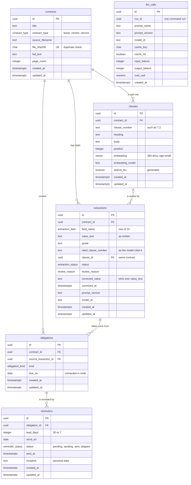

# Entity relationship diagram: ContractTracker

PostgreSQL 16 with pgvector. 6 tables, 6 relationships. `llm_calls` has no relationship: it is an append-only ledger keyed by cache key, read only as a sum.

## Diagram

## Relationships

| From | | To | Meaning |
| --- | --- | --- | --- |
| contracts | one-to-many | clauses | A contract is split into numbered clauses; deleting the contract removes them (CASCADE). |
| contracts | one-to-many | extractions | Each contract has its 10 fields; they go with the contract (CASCADE). |
| clauses | zero-or-one to many | extractions | A field's quote cites one clause of the same contract, enforced by the composite key; null when the cited number does not exist. |
| contracts | one-to-many | obligations | A contract's dated duties; they go with the contract (CASCADE). |
| extractions | one-to-many | obligations | Each date is cited to one field of the same contract (composite key); any correction recomputes all of the contract's dates, and a removed field removes its dates (CASCADE). |
| obligations | one-to-many | reminders | Each obligation gets a 30-day and a 7-day reminder; a removed date must never be emailed (CASCADE). |
